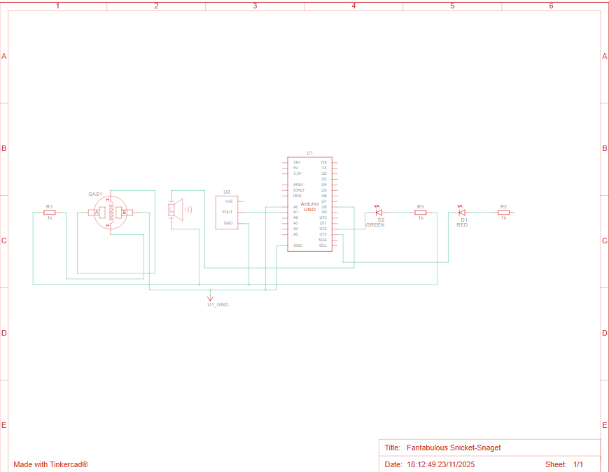

# 🔥 Smart Fire Guard - Hệ Thống Báo Cháy Thông Minh AI & IoT

> **Đề tài:** Xây dựng hệ thống phát hiện hỏa hoạn sớm sử dụng kết hợp IoT (Cảm biến) và AI (Computer Vision).

> **Mạch của Smart Fire Guard - Hệ Thống Báo Cháy Thông Minh AI & IoT**
https://www.tinkercad.com/things/d4mDpZQCGvu/editel?returnTo=%2Fdashboard&sharecode=ee_s1_Dfyk-gssZoB6ftxIT9YzzTqnTQhMu_N-t-6HU

> **Tập dữ liệu sử dụng để training**
https://www.kaggle.com/datasets/phylake1337/fire-dataset

## 📖 Giới thiệu

**Smart Fire Guard** là giải pháp báo cháy lai (Hybrid), khắc phục nhược điểm của các hệ thống báo cháy truyền thống. Hệ thống không chỉ dựa vào cảm biến vật lý (Nhiệt/Khí) mà còn sử dụng **Camera AI** để phát hiện ngọn lửa từ xa ngay khi chưa có khói lan tỏa.

### 🌟 Tính năng chính
* **Giám sát đa kênh:** Kết hợp dữ liệu từ cảm biến Nhiệt độ, Khí Gas và Hình ảnh Camera.
* **AI Vision:** Sử dụng mô hình Deep Learning (**MobileNetV2**) để nhận diện ngọn lửa theo thời gian thực.
* **Cảnh báo tức thời:**
    * **Tại chỗ:** Còi hú (Buzzer) và Đèn LED cảnh báo.
    * **Từ xa:** Gửi Email cảnh báo kèm thời gian thực qua giao thức SMTP.
* **Dashboard trực quan:** Giao diện Web (Flask) hiển thị video stream, biểu đồ nhiệt độ/gas và nhật ký hoạt động (Log).
* **Chế độ Mô phỏng (Simulation):** Hỗ trợ chạy thử nghiệm không cần phần cứng thật (Mock Data).

---

## 🛠️ Kiến trúc Hệ thống

### 1. Phần cứng (Hardware)
* **Vi điều khiển:** Arduino Uno R3.
* **Cảm biến:**
    * MQ-2 (Cảm biến Khí Gas/Khói).
    * TMP36 (Cảm biến Nhiệt độ).
* **Output:** Piezo Buzzer (Còi), LED Đỏ/Xanh.

### 2. Phần mềm (Software Stack)
* **Backend:** Python, Flask.
* **AI/Computer Vision:** OpenCV, TensorFlow/Keras (MobileNetV2).
* **Giao tiếp:** PySerial (Giao tiếp USB UART).
* **Frontend:** HTML/CSS, index.html.

---

## 🔌 Sơ đồ Đấu nối (Pinout)

| Linh kiện | Chân linh kiện | Arduino Pin | Ghi chú |
| :--- | :--- | :--- | :--- |
| **Gas Sensor (MQ-2)** | Analog Out | **A0** | Cần điện trở tải 4.7kΩ nối đất |
| **Temp Sensor (TMP36)** | Vout (Giữa) | **A1** | |
| **Buzzer (Còi)** | Dương (+) | **D8** | |
| **LED Xanh (Safe)** | Dương (+) | **D12** | Qua trở 220Ω |
| **LED Đỏ (Alarm)** | Dương (+) | **D13** | Qua trở 220Ω |


---

## 🚀 Cài đặt & Hướng dẫn chạy (Dùng Môi trường ảo)

### Bước 1: Chuẩn bị mã nguồn
Tải project về máy và mở bằng VS Code (hoặc Terminal).

### Bước 2: Thiết lập môi trường ảo (.venv)
Mở Terminal và chạy lần lượt các lệnh sau:

**1. Tạo môi trường ảo:**
```bash
python -m venv .venv
```

**2. Kích hoạt môi trường (Windows PowerShell):**
```bash
.venv\Scripts\activate
```

**3. Cài đặt các thư viện cần thiết:**
```bash
pip install -r requirements.txt
```
### Bước 3: Nạp code Arduino
1.  Mở file arduino_code/arduino_code.ino bằng Arduino IDE.

2.  Kết nối Arduino với máy tính qua cổng USB.

3.  Chọn đúng cổng COM và Board (Arduino Uno).

4.  Bấm Upload.

### Bước 4: Cấu hình hệ thống (File app.py)
Mở file app.py và chỉnh sửa:

```bash
USE_ARDUINO = True        # True nếu cắm mạch thật, False nếu chạy giả lập
SERIAL_PORT = 'COM3'      # Cổng COM của Arduino
EMAIL_SENDER = "email@gmail.com" # Email để gửi cảnh báo
EMAIL_PASSWORD = "mk_ung_dung_16_ky_tu" # App Password của Google (bắt buộc có xác thực 2 yếu tố)
```

### Bước 5: Chạy ứng dụng
Đảm bảo môi trường ảo vẫn đang kích hoạt (.venv), chạy lệnh:

**1. Training AI (Chạy 1 lần đầu tiên):**
```bash
python train_model.py
```

**2. Chạy Web Server:**
```bash
python app.py
```

Truy cập trình duyệt tại địa chỉ: http://127.0.0.1:5000

## 📂 Cấu trúc Thư mục

  SmartFireGuard/
  │
  ├── app.py                
  ├── train_model.py        
  │
  ├── arduino_code.ino      
  │
  ├── dataset/              
  │   ├── fire/             
  │   └── non_fire/         
  │
  ├── templates/
  │   └── index.html        
  │
  └── README.md             

## ⚠️ Khắc phục lỗi thường gặp
**1.Lỗi ModuleNotFoundError:**

  Quên kích hoạt môi trường ảo. Hãy chạy .venv\Scripts\activate trước.

**2.Lỗi Email 535...:**

  Bạn đang dùng mật khẩu Gmail thường. Hãy tạo Mật khẩu ứng dụng (App Password) 16 ký tự.

**3.Lỗi Camera not found:**

  Kiểm tra quyền truy cập Camera trên trình duyệt.

## 👨‍💻 Tác giả
  Họ và tên: Lê Phước Hậu

  Lớp/MSSV: 2033221314 - Nhóm 16

  Dự án: Đồ án IoT/AI - Smart Fire Guard